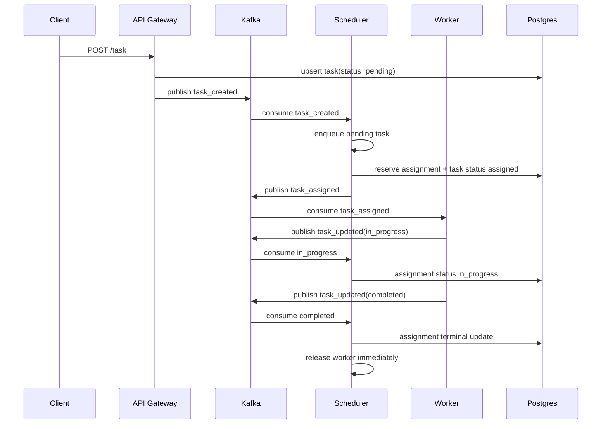
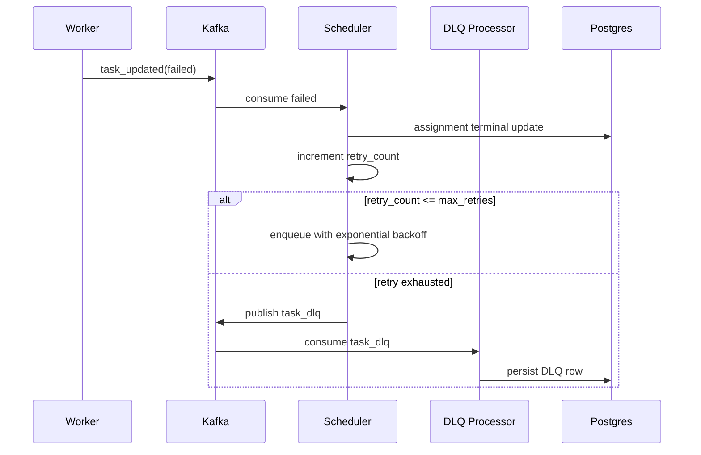
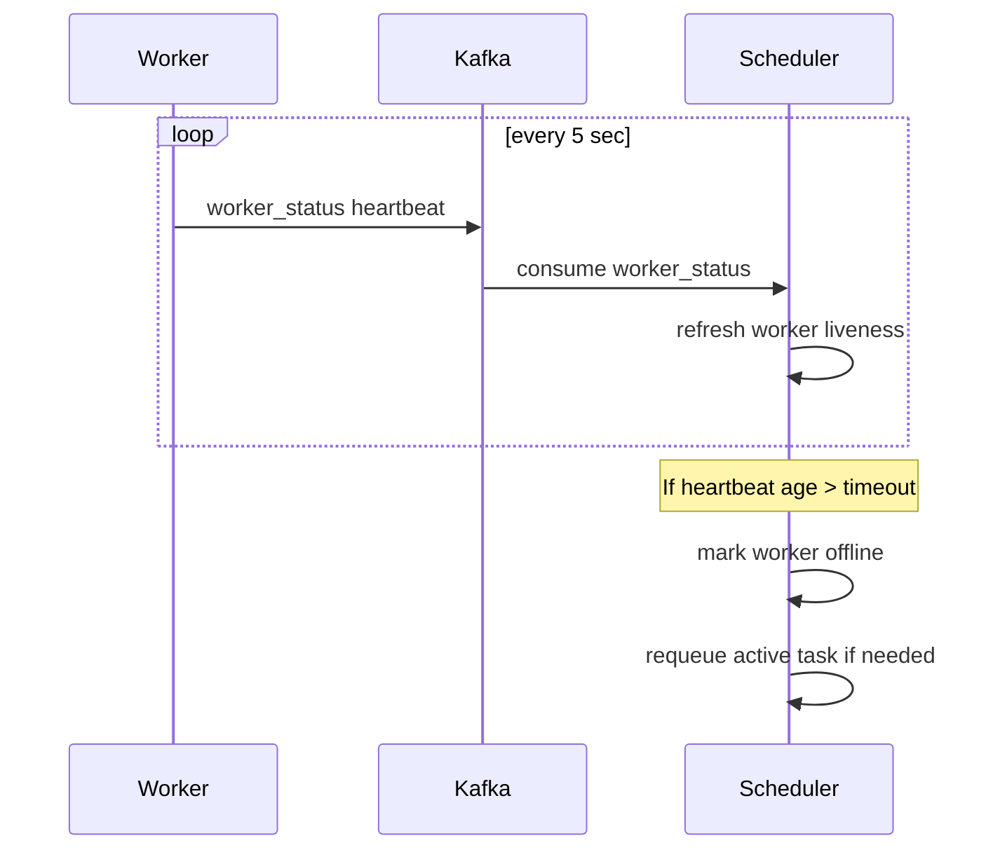

# Architecture and Sequence Artifacts

## System Components

- API Gateway (FastAPI): accepts task and worker API calls, publishes events, serves dashboard and read-model views.
- Scheduler: consumes task and worker events, applies fairness-aware assignment, manages retries, heartbeat timeout/offline handling.
- Worker replicas: consume assignments and emit lifecycle updates (`in_progress`, `completed`, `failed`).
- DLQ Processor: consumes `task_dlq` events and persists operator-facing DLQ records.
- PostgreSQL: durable store for tasks, assignments, workers, event-log, processed-events, and DLQ rows.
- Kafka: event transport backbone (`task_created`, `task_assigned`, `task_updated`, `worker_status`, `task_dlq`).

## Sequence: Normal Assignment

## Sequence: Failure, Retry, DLQ

## Sequence: Worker Heartbeat Timeout

## Wave 1 Design Notes

- Assignment fairness now considers cumulative assignment load and least-recently-assigned tie-break.
- Worker reuse is event-driven on terminal updates; heartbeat remains primarily a liveness safety mechanism.
- Idempotency is enforced using consumer-scoped `processed_events` plus bounded in-memory dedupe sets.
